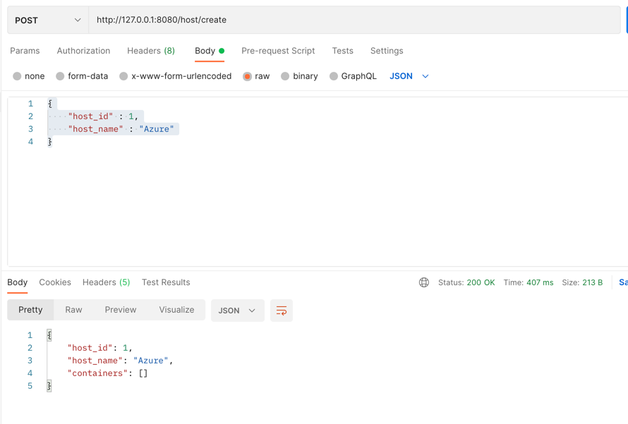
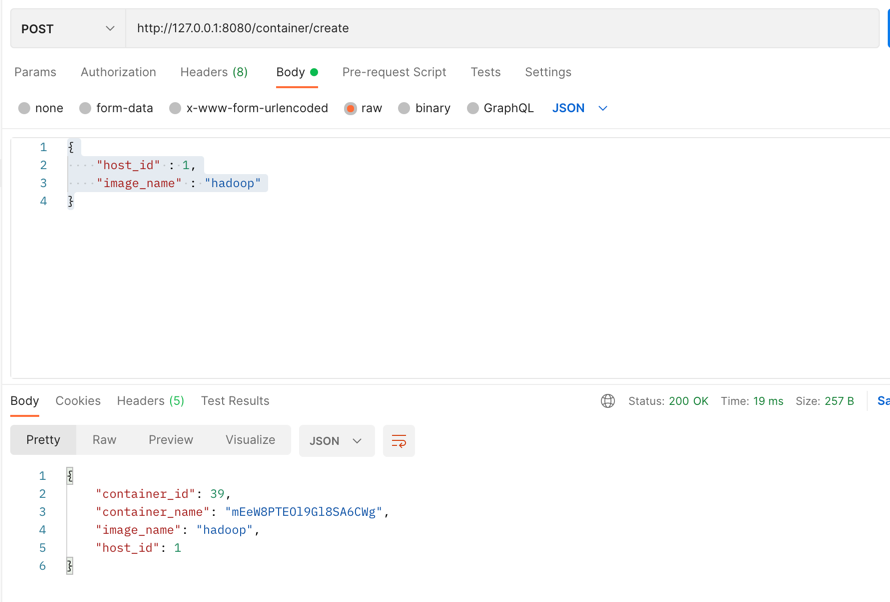
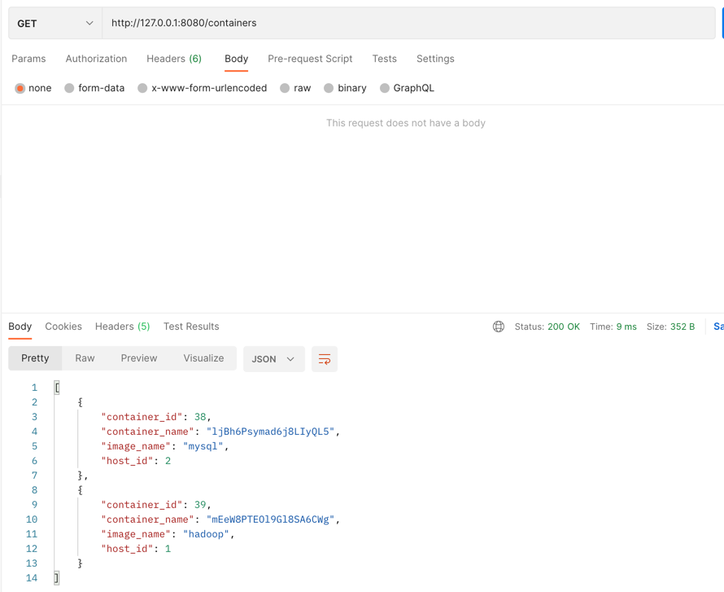
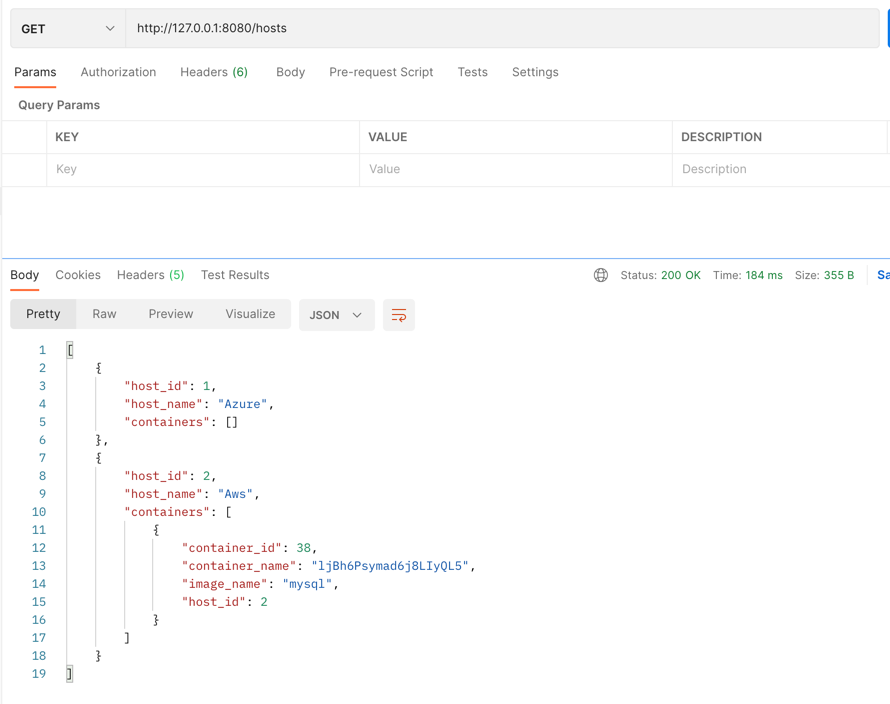
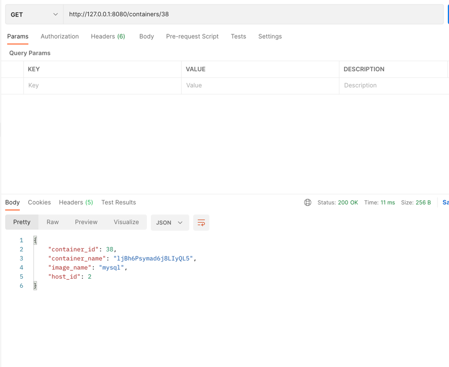
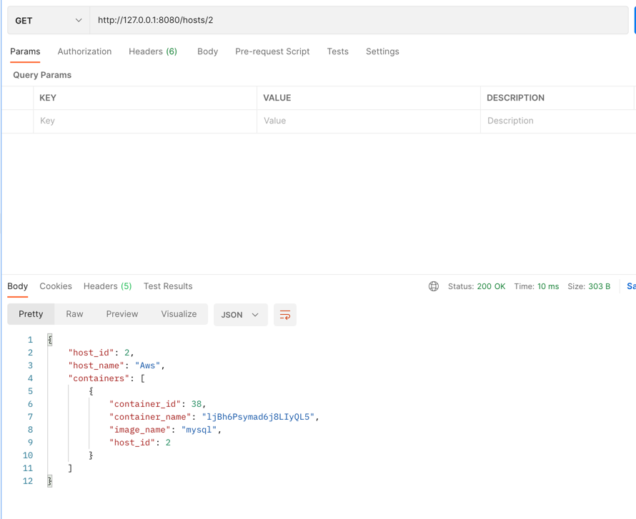
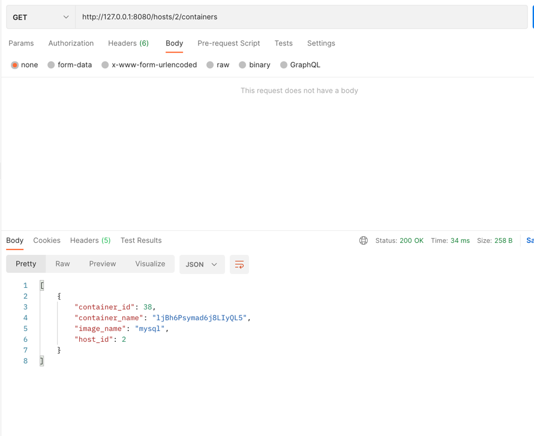

Pre-requisite:

    1. Install MySQL

    2. Create a 'test' database

1. Starter class for the application- Spring Boot application:  com.sachin.DockerMain

2. com.sachin.service

    - It contains two classes which are mapped to MySql db using hibernate:
        1. Host 
        2. Container
    
3.  com.sachin.service
    - It contains ContainerService class which generates random name for the new container
    
4. com.sachin.repository
    - It contains two files:
        1. HostController.java which contains all the api's related to host
        2. ContainerController.java which contains all the api's related to container
    
5. application.propertis file contains all the details related to mysql database

6. Steps to run:
   
    1. Start the springboot application using:
        1. Cli-  mvn springboot:run
        2. Directly run the application using run icon
    2. Test the api's using postman and check the results inside MySQL database
    

7. Sample API's
    1. Create a host:
        1. http://127.0.0.1:8080/host/create
            1. Request Body  
            {
           "host_id" : 1,
           "host_name" : "Azure"
           }
               
        2. Response
        
       
    2. Create a container
       1. http://127.0.0.1:8080/container/create
            1. Request Body
               
               {
               "host_id" : 1,
               "image_name" : "hadoop"
               }
               
            2. Response
            
               
    3. Get all containers
        1. http://127.0.0.1:8080/containers
        2. Response
        
    4. Get all hosts
        1. http://127.0.0.1:8080/hosts
        2. Response
        
    5. Get container by id:
        1. http://127.0.0.1:8080/containers/{id}
        2. Response
        
    6. Get host by id:
        1. http://127.0.0.1:8080/hosts/{id}
        2. Response
        
    7. Get containers for a given host:
        1. http://127.0.0.1:8080/hosts/{id}/containers
        2. Response
        
           

Note: The host_id  is a foreign key in 'Container' table and primary key in 'Host' table.
    
